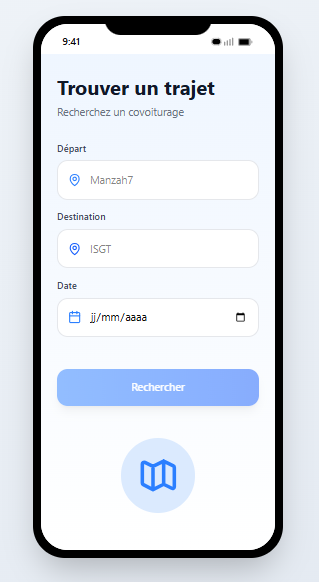
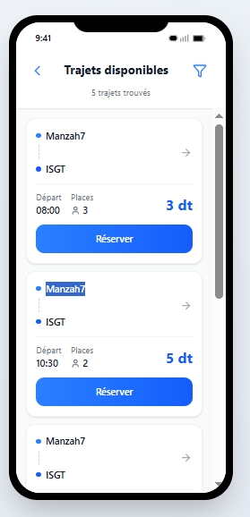

# covoiturage-universitaire
Plateforme de covoiturage universitaire développée en Java dans le cadre du module AGL. Java | AGL | Scrum | GitHub | Projet universitaire

## Maquettes Figma

### Fonctionnalité : Réservation

Prototype navigable : [Voir le prototype Figma]
( https://www.figma.com/make/ObkTanuAsNg2885mhju5sL/Covoiturage-universitaire-mobile?t=XaH26pE0HlM21Lg1-1 )

**Écran 1 — Détails du trajet**  

**Écran 2 — Confirmation de réservation**  

### Fonctionnalité : Recherche

Prototype navigable : [Voir le prototype Figma]
(https://www.figma.com/make/6YDYI0QkPMFsQ269WHTwFu/Covoiturage-mobile-prototype?t=T7oFMf60pQ94VeKi-1 )

**Écran 1 — trouver trajet** 

**Écran 2 — trajets disponibles ** 

