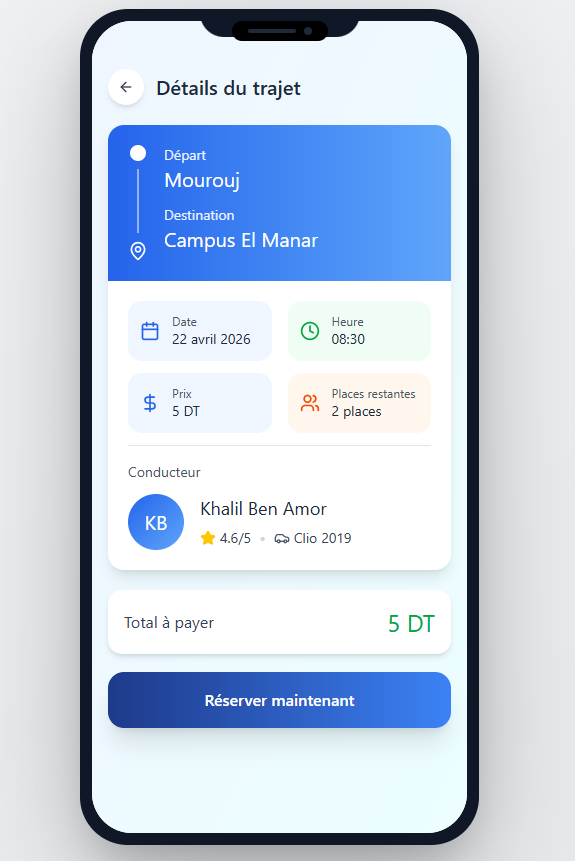
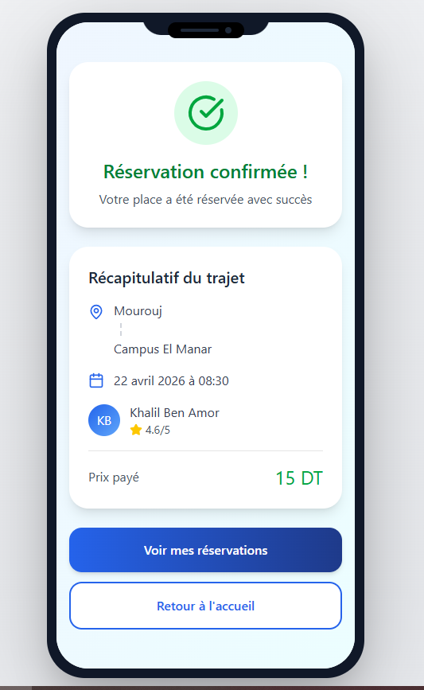

# covoiturage-universitaire
Plateforme de covoiturage universitaire développée en Java dans le cadre du module AGL. Java | AGL | Scrum | GitHub | Projet universitaire

## Maquettes Figma

Prototype navigable : [Voir le prototype Figma]
( https://www.figma.com/make/ObkTanuAsNg2885mhju5sL/Covoiturage-universitaire-mobile?t=XaH26pE0HlM21Lg1-1 )

### Fonctionnalité : Réservation

**Écran 1 — Détails du trajet**  

**Écran 2 — Confirmation de réservation**  

